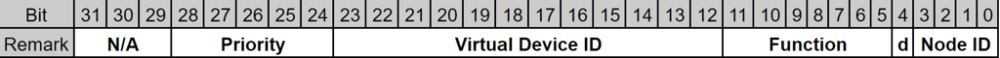

# CAN Packet (Bi-Direction, Firmware ↔︎ ROS driver)

The Main Controller communicates with the specified sub-controller (*Top Controller*) through a CAN interface.  
The CAN Packet serves as the communication medium for this interface and is utilized for two primary purposes:  
- Reporting: Forwarding status and measurement data from the Top Controller to the ROS driver. This report packet is transmitted from the firmware to the ROS driver via UDP port **49166**.   
The transmission interval varies depending on the Virtual Device ID.  
- Control: Delivering command instructions from the ROS driver to peripheral devices managed by the Top Controller.   
This command packet must be sent from the ROS driver to the firmware through UDP port number **49165**.

---

## Field Layout
The firmware and the ROS driver share the same packet structure for the CAN packet.

| Byte Offset | Field Name | Type | Size (Bytes) | Description |
|--------------|-------------|------|---------------|--------------|
| 0 - 3  | Header | Non-Timestamp Header | 4 | Please refer to [Non-Timestamp Header](packet-structure.md#non-timestamp-header). |
| 4 - 7  | CAN id | 32-bit unsigned integer | 4 | Please refer to Extended CAN ID specification. |
| 8      | RTR    | unsigned char | 1 | This field specifies the Remote Transmission Request (RTR) frame type of the CAN interface.  0: Data frame 1: Remote frame Currently, only the Data frame (0) is used. |
| 9      | IDE    | unsigned char | 1 | CAN Id type.  0: Standard Id  1: Extended Id  Currently, only the Extended Id (1) is used. |
| 10     | DLC    | unsigned char | 1 | Data length from the CAN data frame.  Maximum = 8 |
| 11 - 18| Data[8]| unsigned char array | 8 | Data field of the CAN frame. |

---

### Extended CAN ID Specification

- Priority  
    - Defines the arbitration priority of the packet.

    - Lower numerical values indicate higher priority on the CAN bus:  
      0x00: Highest  
      0x02: High  
      0x04: Medium  
      0x10: Low  
      0x1F: Lowest 

- Virtual Device ID  
    - Identifies the logical or virtual device associated with this packet.  
    - Please refer to the [Virtual Device ID](#virtual-device-id-list) List for the mapping.  

- Function
    - Specifies the function or message type of the packet (e.g., *Set, Report*).  

- D
    - Indicates the communication direction:  
      0: ROS driver → Firmware  
      1: Firmware → ROS driver

- Node Id
    - Identifies the node on the CAN network.
    - A fixed value of `0x2` is used in this implementation.

### Virtual Device ID List

| Device ID | Name | Functions | Priority | DLC | Data Layout | Description |
|-----------|------|-----------|----------|-----|-------------|-------------|
| 0x000 | Version | 0x1: Query (ROS driver → Firmware) / Response (Firmware → ROS driver) | Low | 0 for Query 4 for Response | Query: Data[0 - 7] Set to 0.  Response: Data[0] - Major Data[1] - Minor Data[2] - Revision Data[3] - Build Data[4 - 7] - Set to 0. | This device uses only one function code (0x1). The distinction between a query and a response is made by the Direction (D) bit in the CAN ID. |
| 0x020 | Power Monitor | 0x1: Report (Firmware → ROS driver) | High | 8 | Data[0] ~ [3] - 32-bit float electric current value[A] of the main power line Data[4] ~ [7] - 32-bit float electric voltage value[V] of the main power line  All values are LSB (Little Endian). | This device measures and reports the current and voltage of the Top Controller's main power line at 100 ms intervals. |
| 0x040 | Tower Light | 0x1: Report (Firmware → ROS driver) 0x2: Set new state | Medium | 1 | Bit 0 - Red Bit 1 - Green Bit 2 - Orange(Yellow) Bit 3 ~ 7 - Reserved (must be set to 0)  LSB 0 - OFF 1 - ON | This device can control the tower light of the robot. |

#### Usage
To receive CAN report packets from the firmware, the ROS driver must first send a [COMS_COMMAND_ENABLE_CAN_COMM](maincoms-packet.md#maincoms-command-parameter) command packet. Without this command, the firmware will not transmit CAN report packets.

- Version  
When the ROS driver transmits a Query command, the firmware responds with the version information.

- Power Monitor  
No explicit Query command is required. Voltage and current values of the Top Controller’s power line are reported automatically at 100 ms intervals.

- Tower Light  
The current state of the Tower Light is reported at 100 ms intervals.  
To change the Tower Light state, the ROS driver must send a Set new state function code along with the desired data. The firmware does not generate a dedicated response packet; instead, the updated state can be confirmed through the subsequent periodic report.